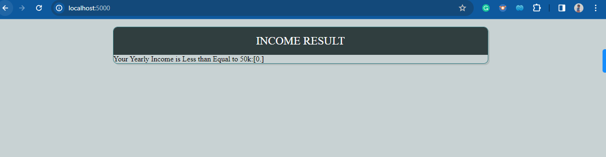

# Adult-Census-Income-Prediction
End-to-End ML Project
# Business Statement
Based on the independent features we are going to predict whether the particular person salary is less than or
greater than 50k

### Solution Proposed
We will use supervised learning algorithms and predict the model.

### How to run the project

```
pip install -r requirements.txt
```
To run this project you need to have Python installed in your system, also make sure that you have all the libraries mentioned in the requirement file.

In the end run
```
python app.py
```
go to your web browser and type

```
localhost: 5000
```


output image

